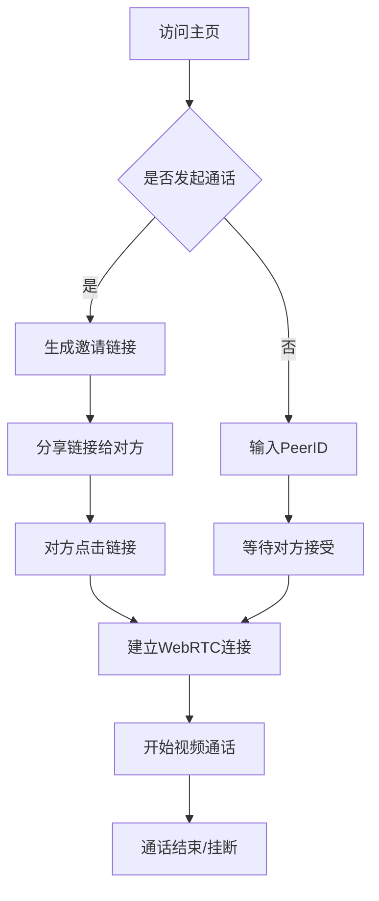

## 1. 产品概述
开发一个纯前端静态视频聊天网页应用，用户可通过唯一令牌链接实现一对一视频通话匹配。该应用无需后端服务器支持，采用WebRTC技术建立点对点连接，确保通话安全性和低延迟性能。

目标用户：需要快速、便捷进行一对一视频通话的个人用户和小型团队，特别适用于临时会议、远程协助和社交场景。

## 2. 核心功能

### 2.1 用户角色
| 角色 | 注册方式 | 核心权限 |
|------|----------|----------|
| 通话发起者 | 无需注册，自动生成PeerID | 生成邀请链接、发起通话、控制媒体设备 |
| 通话接收者 | 无需注册，通过链接加入 | 接受通话、控制本地媒体设备 |

### 2.2 功能模块
应用包含以下核心页面：
1. **主页**：摄像头预览、生成邀请链接、加入通话输入框
2. **通话页面**：视频通话窗口、媒体控制栏、挂断功能

### 2.3 页面详情
| 页面名称 | 模块名称 | 功能描述 |
|----------|----------|----------|
| 主页 | 摄像头预览 | 显示本地摄像头画面，支持切换前后摄像头（移动设备） |
| 主页 | 链接生成 | 生成包含唯一PeerID的邀请链接，支持一键复制 |
| 主页 | 加入通话 | 输入对方链接中的PeerID即可加入通话 |
| 通话页面 | 视频窗口 | 同时显示本地和远程视频流，支持画中画模式 |
| 通话页面 | 控制栏 | 麦克风开关、摄像头开关、挂断按钮、切换摄像头 |
| 通话页面 | 状态指示 | 显示连接状态、网络质量、通话时长 |

## 3. 核心流程

### 通话发起流程
1. 用户A访问主页，系统自动获取摄像头权限
2. 用户A点击"生成邀请链接"，系统创建唯一PeerID
3. 系统生成包含PeerID的URL链接，用户A复制链接分享给用户B
4. 用户B点击链接，自动跳转到通话页面并尝试连接用户A
5. 双方确认后建立WebRTC连接，开始视频通话

### 通话接收流程
1. 用户B收到邀请链接，点击访问
2. 系统解析URL中的PeerID参数
3. 自动请求摄像头权限并显示预览
4. 尝试与用户A建立点对点连接
5. 连接成功后开始双向视频通话

## 4. 用户界面设计

### 4.1 设计风格
- **主色调**：深蓝色渐变（#1E3A8A 到 #3B82F6）
- **辅助色**：白色背景、灰色边框、红色挂断按钮
- **按钮样式**：圆角矩形，悬停效果，阴影深度
- **字体**：系统默认字体，标题18-24px，正文14-16px
- **布局**：卡片式布局，响应式网格系统
- **图标**：使用Emoji或SVG图标，简洁直观

### 4.2 页面设计详情
| 页面名称 | 模块名称 | UI元素 |
|----------|----------|----------|
| 主页 | 摄像头预览 | 圆形视频预览窗口(200x200px)，位于页面中央，支持点击全屏 |
| 主页 | 控制按钮 | 大圆形按钮(60px)，包含摄像头/麦克风开关图标，底部排列 |
| 主页 | 链接生成区 | 输入框显示生成的链接，复制按钮在右侧，支持一键复制 |
| 主页 | 加入通话 | 文本输入框+圆形确认按钮，简洁明了 |
| 通话页面 | 视频布局 | 远程视频全屏显示，本地视频小窗口(120x90px)右下角悬浮 |
| 通话页面 | 控制栏 | 底部工具栏，包含3个主要控制按钮，等距排列 |
| 通话页面 | 状态栏 | 顶部显示连接状态和通话时长，半透明背景 |

### 4.3 响应式设计
- **桌面端**：主内容区最大宽度800px，视频窗口16:9比例
- **平板端**：自适应屏幕宽度，保持元素比例和可读性
- **手机端**：单列布局，大按钮设计(最小44px触摸区域)，支持横竖屏切换
- **触摸优化**：按钮大小适配手指操作，支持滑动和手势控制

### 4.4 性能要求
- 页面加载时间：≤3秒（首次访问）
- 视频连接建立时间：≤5秒
- 视频延迟：≤200ms
- 支持分辨率：自动适配最高720p
- 帧率：根据网络状况自动调整(15-30fps)
- 浏览器兼容性：Chrome 70+, Firefox 65+, Safari 12+, Edge 79+