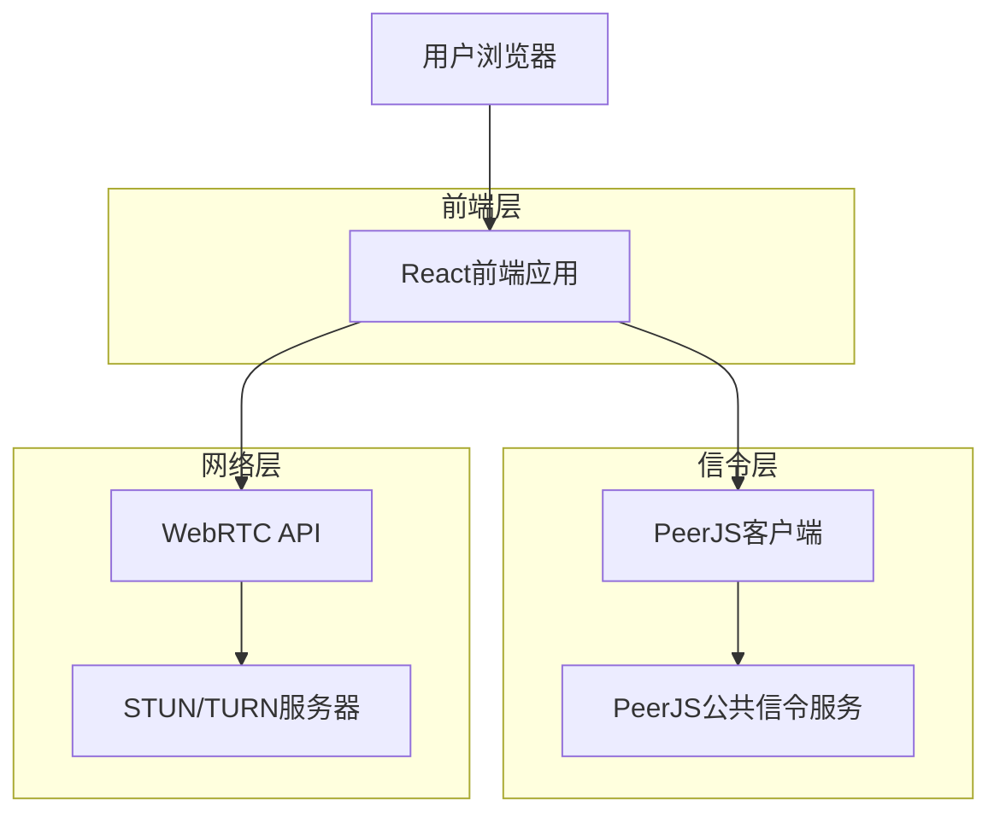

## 1. 架构设计



## 2. 技术描述

- **前端框架**：React@18 + TypeScript
- **构建工具**：Vite
- **样式框架**：TailwindCSS@3
- **WebRTC库**：PeerJS（客户端）
- **信令服务**：PeerJS公共服务器（无需自建）
- **状态管理**：React Hooks（useState, useEffect）
- **路由**：React Router@6（单页应用）
- **初始化工具**：vite-init

### 核心依赖包
```json
{
  "dependencies": {
    "react": "^18.2.0",
    "react-dom": "^18.2.0",
    "peerjs": "^1.4.7",
    "react-router-dom": "^6.8.0"
  },
  "devDependencies": {
    "@types/react": "^18.0.0",
    "@types/react-dom": "^18.0.0",
    "@vitejs/plugin-react": "^3.1.0",
    "autoprefixer": "^10.4.13",
    "postcss": "^8.4.21",
    "tailwindcss": "^3.2.6",
    "typescript": "^4.9.3",
    "vite": "^4.1.0"
  }
}
```

## 3. 路由定义

| 路由 | 用途 |
|------|------|
| / | 主页，摄像头预览和链接生成 |
| /call/:peerId | 通话页面，接收带PeerID的链接 |
| /call | 通话页面，直接访问时生成新PeerID |

## 4. 核心组件架构

### 4.1 WebRTC连接管理
```typescript
interface PeerConnectionState {
  peer: Peer | null;
  connection: DataConnection | MediaConnection | null;
  localStream: MediaStream | null;
  remoteStream: MediaStream | null;
  isConnected: boolean;
  error: string | null;
}

interface MediaControls {
  audioEnabled: boolean;
  videoEnabled: boolean;
  isFrontCamera: boolean;
}
```

### 4.2 PeerJS配置
```typescript
const peerConfig = {
  host: '0.peerjs.com',
  port: 443,
  secure: true,
  config: {
    iceServers: [
      { urls: 'stun:stun.l.google.com:19302' },
      { urls: 'stun:stun1.l.google.com:19302' }
    ]
  }
};
```

### 4.3 媒体流管理
```typescript
class MediaStreamManager {
  async getUserMedia(constraints: MediaStreamConstraints): Promise<MediaStream>;
  toggleAudio(stream: MediaStream): boolean;
  toggleVideo(stream: MediaStream): boolean;
  switchCamera(stream: MediaStream): Promise<MediaStream>;
  stopStream(stream: MediaStream): void;
}
```

## 5. 安全策略

### 5.1 内容安全策略（CSP）
```html
<meta http-equiv="Content-Security-Policy" 
      content="default-src 'self';
               connect-src 'self' wss://0.peerjs.com https://0.peerjs.com;
               media-src 'self' blob:;
               img-src 'self' data: blob:;
               style-src 'self' 'unsafe-inline';
               script-src 'self';
               worker-src 'self' blob:;">
```

### 5.2 WebRTC安全特性
- 端到端加密：DTLS-SRTP协议自动加密媒体流
- 信令安全：使用HTTPS和WSS协议
- 身份验证：基于PeerID的临时会话验证
- 权限控制：用户必须明确授权摄像头和麦克风访问

## 6. 性能优化

### 6.1 代码分割
```typescript
// 路由级别的代码分割
const HomePage = lazy(() => import('./pages/HomePage'));
const CallPage = lazy(() => import('./pages/CallPage'));
```

### 6.2 媒体流优化
- 自适应码率：根据网络状况动态调整视频质量
- 回声消除：启用浏览器内置音频处理
- 视频编解码：优先使用H.264编码
- 网络适应：实现ICE候选收集和连接状态监控

### 6.3 资源优化
- 图片压缩：使用WebP格式，懒加载
- CDN加速：静态资源使用CDN分发
- 缓存策略：Service Worker实现离线缓存
- 预加载：关键资源预加载和预连接

## 7. 错误处理

### 7.1 WebRTC错误类型
```typescript
enum WebRTCError {
  PERMISSION_DENIED = 'PERMISSION_DENIED',
  DEVICE_NOT_FOUND = 'DEVICE_NOT_FOUND',
  CONNECTION_FAILED = 'CONNECTION_FAILED',
  NETWORK_ERROR = 'NETWORK_ERROR',
  PEER_DISCONNECTED = 'PEER_DISCONNECTED'
}
```

### 7.2 用户友好的错误提示
- 权限拒绝：引导用户检查浏览器权限设置
- 设备未找到：提示用户检查摄像头/麦克风连接
- 连接失败：提供重试按钮和网络诊断建议
- 网络错误：显示网络状态检测工具

## 8. 浏览器兼容性

### 8.1 WebRTC支持检测
```typescript
const isWebRTCSupported = () => {
  return !!(window.RTCPeerConnection || 
            window.webkitRTCPeerConnection || 
            window.mozRTCPeerConnection);
};
```

### 8.2 降级方案
- 不支持WebRTC：显示兼容性提示页面
- 不支持getUserMedia：提供文件上传替代方案
- 旧版浏览器：引导用户升级到现代浏览器

### 8.3 测试矩阵
| 浏览器 | 最低版本 | 测试状态 |
|--------|----------|----------|
| Chrome | 70 | ✅ 完全支持 |
| Firefox | 65 | ✅ 完全支持 |
| Safari | 12 | ✅ 完全支持 |
| Edge | 79 | ✅ 完全支持 |
| 移动Chrome | 70 | ✅ 支持 |
| 移动Safari | 12 | ✅ 支持 |

## 9. 部署配置

### 9.1 Vite配置
```typescript
// vite.config.ts
export default defineConfig({
  base: './',
  build: {
    target: 'es2015',
    minify: 'terser',
    rollupOptions: {
      output: {
        manualChunks: {
          'react-vendor': ['react', 'react-dom'],
          'peerjs-vendor': ['peerjs']
        }
      }
    }
  },
  server: {
    https: true, // 本地开发使用HTTPS
    port: 3000
  }
});
```

### 9.2 环境变量
```env
VITE_PEERJS_HOST=0.peerjs.com
VITE_PEERJS_PORT=443
VITE_PEERJS_SECURE=true
VITE_APP_VERSION=1.0.0
VITE_STUN_SERVER=stun:stun.l.google.com:19302
```

### 9.3 构建输出
- 静态文件：HTML、CSS、JS、Web Workers
- 总大小：≤500KB（压缩后）
- 加载时间：≤3秒（首次访问）
- 缓存策略：长期缓存静态资源，版本更新时自动刷新